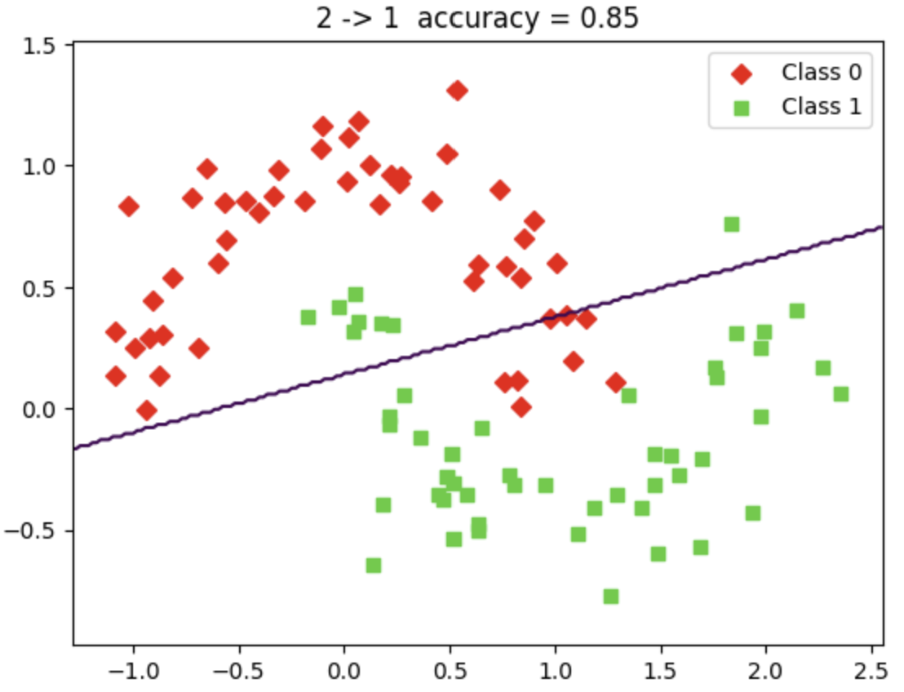
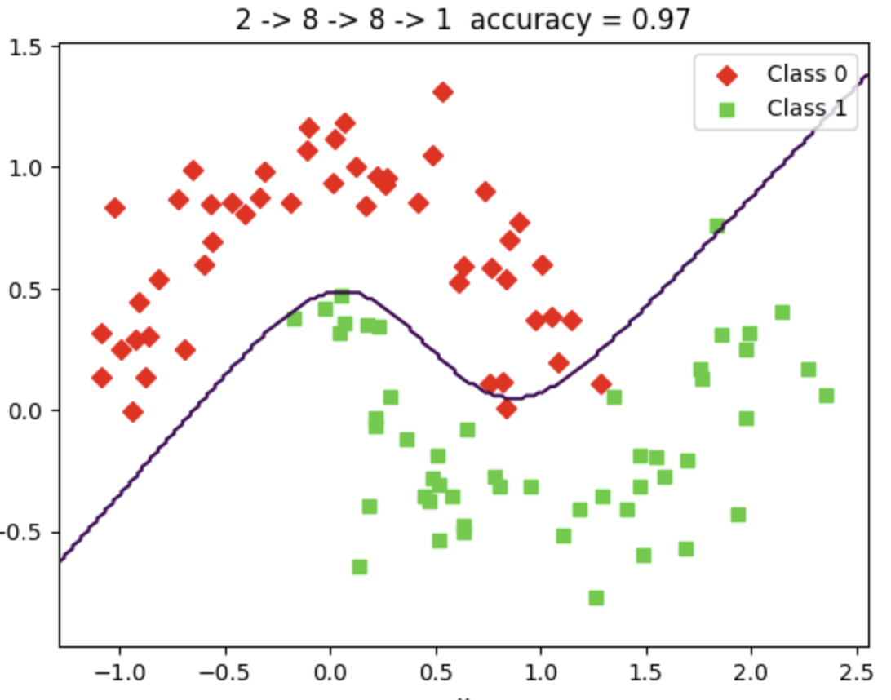
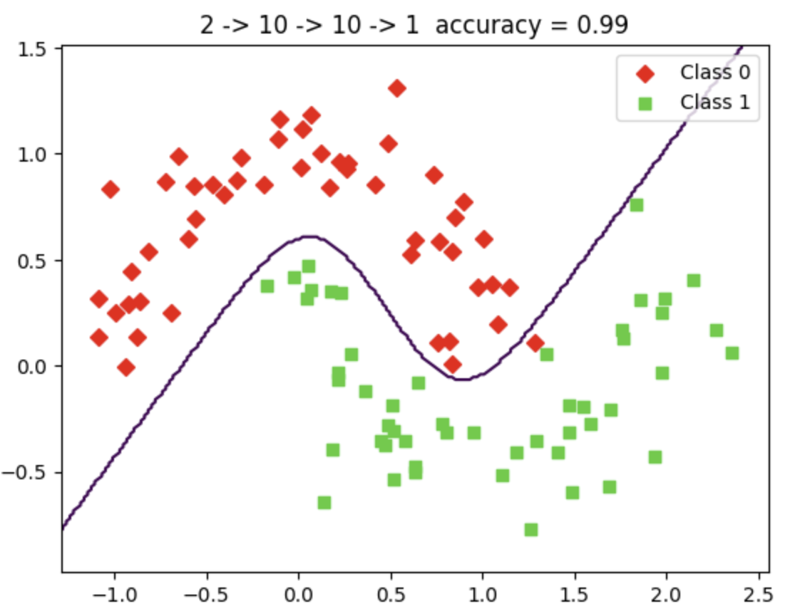

# CV2026 20242044 최승우
## Homework1 - MediaPipe Selfie Segmentation

https://github.com/user-attachments/assets/39c31b82-5030-4e4a-a1f2-70ad82c15831

## Homework1 - Yolo

https://github.com/user-attachments/assets/580c249c-2bf3-48d4-acd3-82bbc98364cd

## Homework2 

<h1><a href="homework/Homework_2.ipynb">Classification_homework 코드보기</a></h1>

### 뉴런이 1개일 때

### 첫 번째 층 8개, 두 번째 층 8개, 출력 뉴런 1개

###  첫 번째 층 10개, 두 번째 층 10개, 출력 뉴런 1개

## 은닉층과 뉴런 수가 증가할수록 신경망이 표현하는 분류경계가 정교해진다.

